# 🛵 FoodPanda Clone — Frontend

A responsive food delivery web app built with React, where customers order food, restaurant owners manage menus and orders, and riders deliver.


> **Backend:** this app needs the Django REST API from
> [foodpanda-clone-backend](https://github.com/fazeensaleem17-byte/foodpanda-clone-backend).

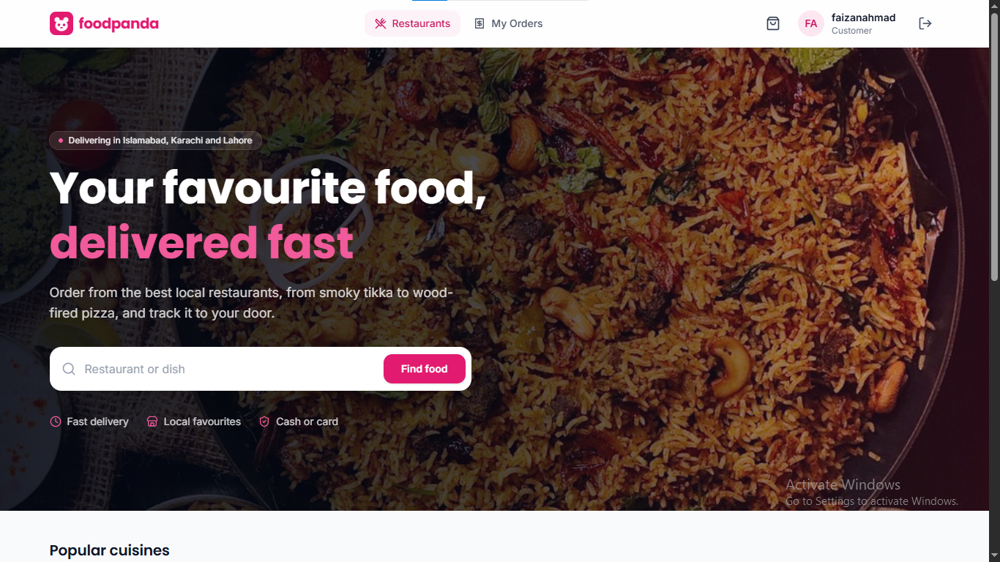

## Table of contents

- [Screenshots](#screenshots)
- [Features](#features)
- [Tech stack](#tech-stack)
- [Architecture](#architecture)
- [Data flow](#data-flow)
- [Getting started (Windows)](#getting-started-windows)
- [Available scripts](#available-scripts)
- [Author](#author)
- [License](#license)

## Screenshots

<table>
  <tr>
    <td width="50%">
      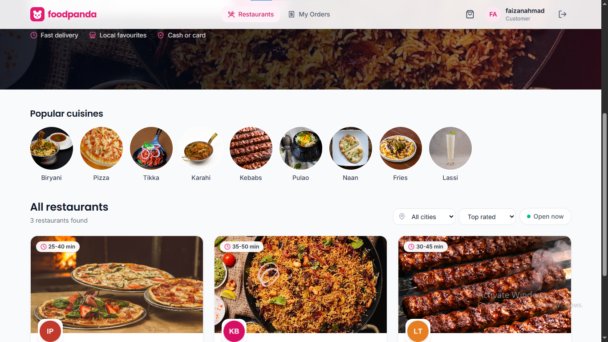<br />
      <sub><b>Restaurants</b>: search, cuisines, city and open-now filters</sub>
    </td>
    <td width="50%">
      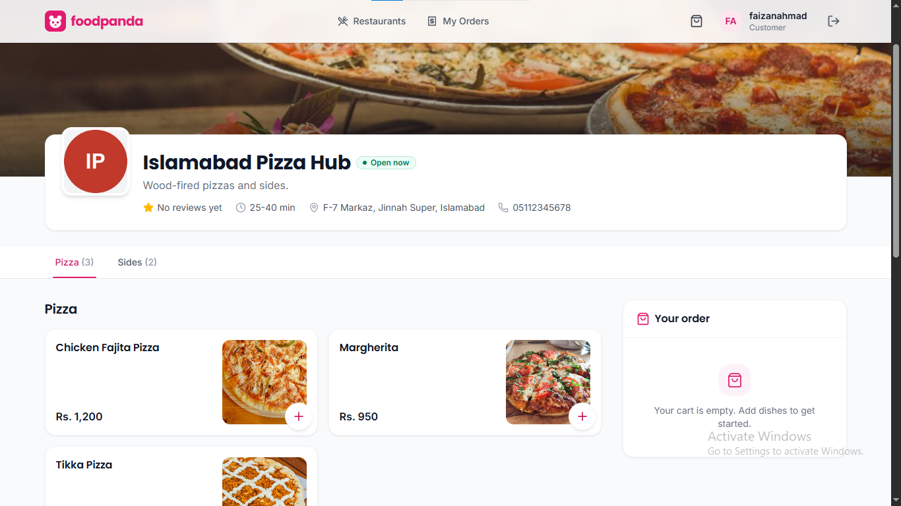<br />
      <sub><b>Restaurant menu</b>: category tabs, dish photos, sticky cart</sub>
    </td>
  </tr>
  <tr>
    <td>
      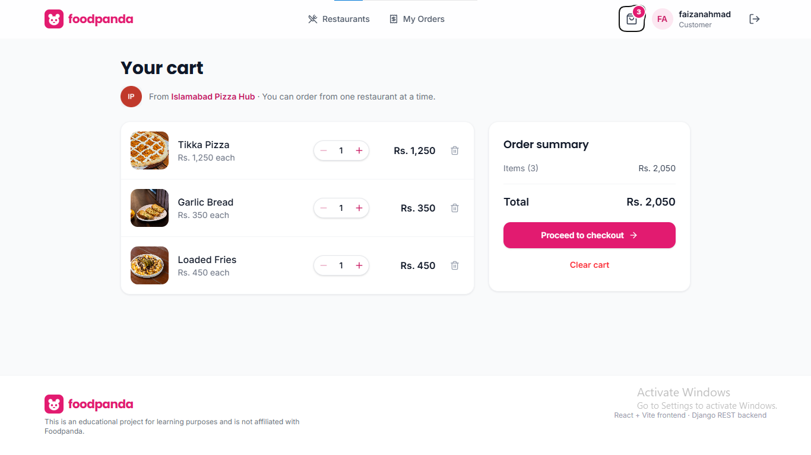<br />
      <sub><b>Cart</b>: quantities and order summary</sub>
    </td>
    <td>
      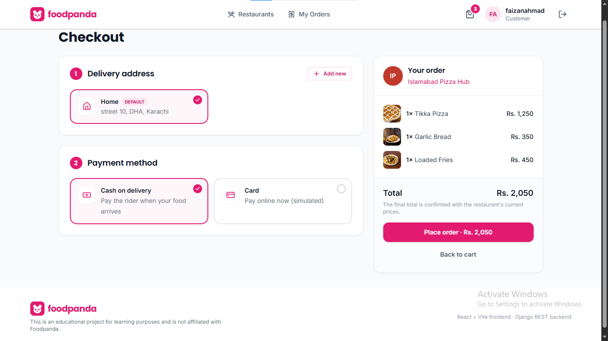<br />
      <sub><b>Checkout</b>: delivery address and payment method</sub>
    </td>
  </tr>
  <tr>
    <td>
      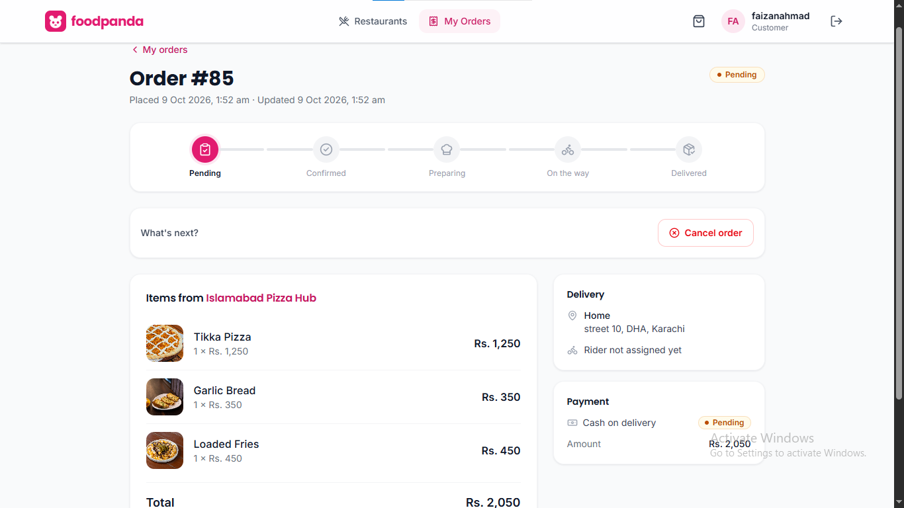<br />
      <sub><b>Order detail</b>: live status timeline</sub>
    </td>
    <td>
      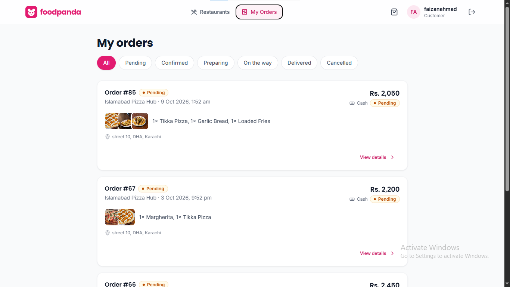<br />
      <sub><b>My orders</b>: history with status filters</sub>
    </td>
  </tr>
  <tr>
    <td>
      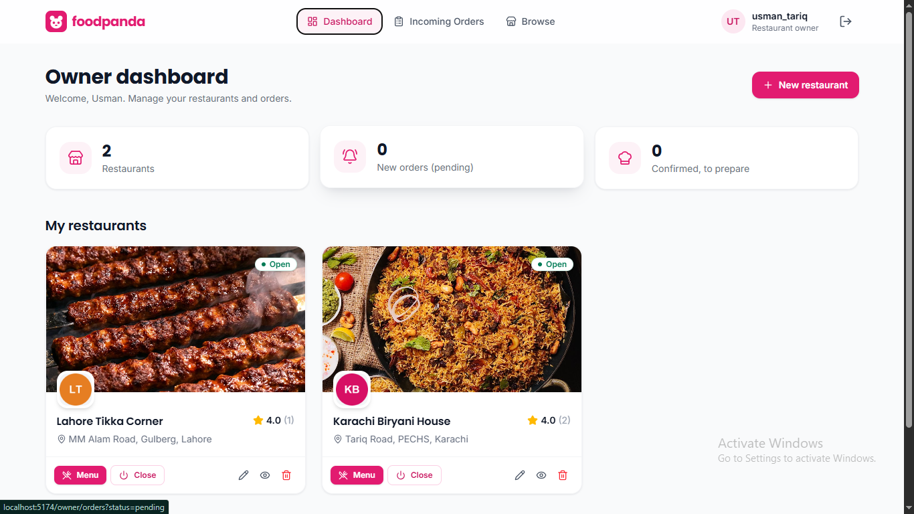<br />
      <sub><b>Owner dashboard</b>: restaurants and order counters</sub>
    </td>
    <td>
      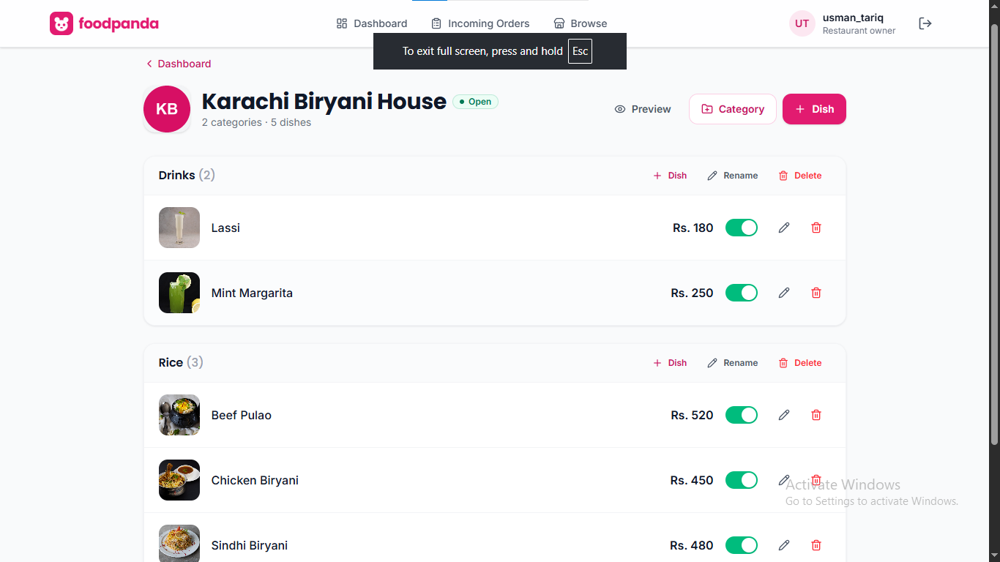<br />
      <sub><b>Owner menu</b>: categories, dishes, availability</sub>
    </td>
  </tr>
  <tr>
    <td>
      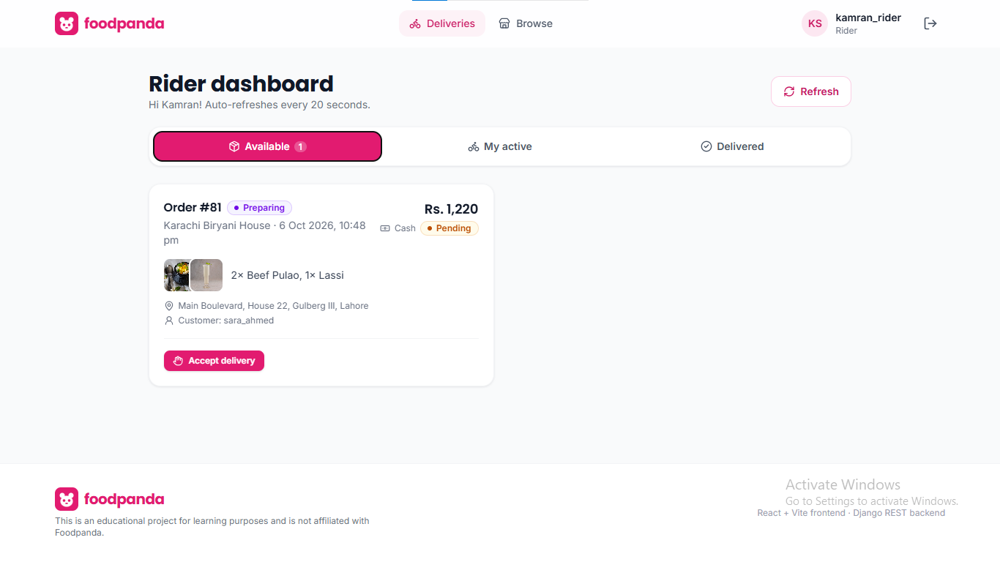<br />
      <sub><b>Rider dashboard</b>: available and active deliveries</sub>
    </td>
    <td>
      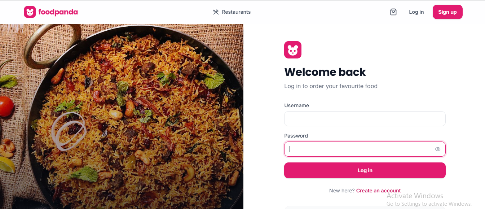<br />
      <sub><b>Login</b></sub>
    </td>
  </tr>
  <tr>
    <td align="center" colspan="2">
      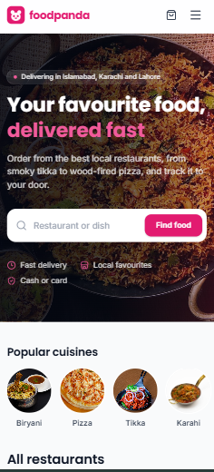<br />
      <sub><b>Mobile</b>: fully responsive down to 360px</sub>
    </td>
  </tr>
</table>

## Features

### Customer

- Browse restaurants with search by name or dish, popular cuisines, city and "open now" filters, and sorting.
- View a restaurant's menu grouped by category, with ratings and reviews.
- Add dishes to a cart. A cart holds one restaurant at a time, and the app warns before replacing it.
- Check out with a saved or new delivery address, paying by cash or (simulated) card.
- Track each order on a status timeline. Cancel while it is still pending; a paid card order is refunded.
- Review a restaurant after a delivered order.
- Edit your profile, change your password and manage delivery addresses.

### Restaurant owner

- Dashboard with your restaurants and counters for new and confirmed orders.
- Create and edit restaurants, including a cover photo and logo upload, and open or close them.
- Manage the menu: categories and dishes, with dish photos and an availability switch.
- Handle incoming orders. Only the next valid status is offered (confirm, start preparing, cancel).

### Rider

- See orders that are ready for pickup and accept one.
- Mark a delivery as on the way, then delivered.
- View delivery history.

### For everyone

- **Mobile responsive.** Tested at 360, 375, 414 and 768px, with a hamburger menu and 40px touch targets on small screens.
- JWT login with automatic token refresh, and routes protected by role.
- Skeleton loaders, empty states, friendly error messages and toast notifications.

## Tech stack

| Area          | Technology                                                 |
| ------------- | ---------------------------------------------------------- |
| UI library    | React 19 (JavaScript, function components and hooks)       |
| Build tool    | Vite 8                                                     |
| Routing       | React Router 7                                             |
| HTTP          | Axios, with JWT request and response interceptors          |
| Styling       | Tailwind CSS 4                                             |
| State         | React Context API (auth and cart)                          |
| Icons / fonts | lucide-react; Poppins and Inter (bundled with Fontsource)  |
| Notifications | react-hot-toast                                            |
| Code quality  | ESLint 9 and Prettier                                      |
| Backend       | Django REST Framework and PostgreSQL (separate repository) |

## Architecture

The code is organised by **feature** (what the app does), not by file type. There are three layers, and imports only point one way:

```
app  ──▶  features  ──▶  shared
```

- **`shared/`** holds generic UI pieces, the axios client and helpers. It never imports from a feature.
- **`features/`** each own one business area. A feature uses `shared/` and, through their `index.js`, other features.
- **`app/`** wires everything together: providers, layout and the route table.

Inside a feature, each kind of code has one home:

| Folder                 | Contains                                                       |
| ---------------------- | -------------------------------------------------------------- |
| `api/` (`.js`)         | Every HTTP call for that resource                              |
| `hooks/` (`.js`)       | Data fetching, state and business logic                        |
| `components/` (`.jsx`) | Presentational pieces that receive props                       |
| `pages/` (`.jsx`)      | One file per route; a page calls hooks and arranges components |
| `index.js`             | The feature's public API                                       |

ESLint enforces these boundaries (`no-restricted-imports`), and the path aliases `@app`, `@features` and `@shared` replace long relative imports.

```
src/
├── main.jsx                 # entry point
├── app/                     # application shell
│   ├── App.jsx              # providers + routes + toasts
│   ├── routes.jsx           # every route, grouped by role
│   ├── providers/           # Router → AuthProvider → CartProvider
│   ├── layouts/             # navbar + page + footer
│   └── styles/              # Tailwind theme and utilities
├── features/
│   ├── auth/                # login, register, profile, session, route guard
│   ├── restaurants/         # home page and restaurant page
│   ├── cart/                # one-restaurant cart
│   ├── orders/              # checkout, my orders, order detail
│   ├── reviews/             # restaurant reviews
│   ├── addresses/           # delivery addresses
│   ├── owner/               # owner dashboard, menu and orders
│   └── rider/               # delivery dashboard
│       └── (each feature: api/ hooks/ components/ pages/ index.js as needed)
└── shared/
    ├── components/ui/       # Modal, SmartImage, ImageUpload, Skeletons, StatusBadge, ...
    ├── components/layout/   # Navbar, Footer, Logo
    ├── lib/                 # axios client, token storage
    ├── hooks/               # useAsync, usePolling
    └── utils/               # formatters, error messages, constants
```

## Data flow

Every request follows the same path. For example, when a customer opens **My Orders**:

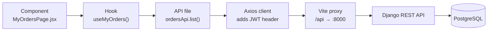

1. **Component.** `MyOrdersPage.jsx` only renders. It calls a hook and shows a skeleton, an error or the list.
2. **Hook.** `useMyOrders()` holds the status filter and page number, and tracks `loading`, `error` and `data`.
3. **API file.** `features/orders/api/ordersApi.js` knows the endpoint and its parameters.
4. **Axios client.** `shared/lib/apiClient.js` adds `Authorization: Bearer <access token>` to the request. If a response is `401`, it refreshes the token once, retries the request, and logs the user out if the refresh fails.
5. **Vite proxy.** The browser calls `/api/...` on its own origin, and Vite forwards it to the Django server, which avoids CORS issues in development.
6. **Django API.** The backend authenticates the token, limits the results to what that role may see, and queries the database.
7. **PostgreSQL.** The rows come back as JSON up the same chain, and React re-renders.

Image uploads use the same path with `multipart/form-data`, and order totals are always calculated by the server.

## Getting started (Windows)

### Prerequisites

- [Node.js](https://nodejs.org/) 18 or newer
- The [backend](https://github.com/fazeensaleem17-byte/foodpanda-clone-backend) set up and **running** on `http://127.0.0.1:8000` (follow its README, including `python manage.py seed_demo` for demo data)

### 1. Clone and install

```bash
git clone https://github.com/fazeensaleem17-byte/foodpanda-clone-frontend.git
cd foodpanda-clone-frontend
npm install
```

### 2. Create your `.env` file

```bash
copy .env.example .env
```

| Variable          | Default                     | Purpose                                                                                        |
| ----------------- | --------------------------- | ---------------------------------------------------------------------------------------------- |
| `VITE_API_URL`    | `http://127.0.0.1:8000/api` | Where the Django API runs. It must end with `/api`, with no trailing slash.                    |
| `VITE_API_DIRECT` | `false`                     | Optional. Set to `true` to skip the Vite proxy and call the API directly (needs CORS enabled). |

`.env` is ignored by git. Restart the dev server after changing it.

### 3. Run

Start the backend in one terminal:

```bash
cd foodpanda-clone-backend
venv\Scripts\activate
python manage.py runserver
```

Start the frontend in another:

```bash
npm run dev
```

Open <http://localhost:5173>. If you see "Cannot reach the server", the backend is not running.

### Demo accounts

The backend's `seed_demo` command creates these users. The shared demo password is listed in the backend README.

| Username       | Role     |
| -------------- | -------- |
| `ali_khan`     | Customer |
| `sara_ahmed`   | Customer |
| `usman_tariq`  | Owner    |
| `hina_malik`   | Owner    |
| `bilal_rider`  | Rider    |
| `kamran_rider` | Rider    |

## Available scripts

| Command           | What it does                              |
| ----------------- | ----------------------------------------- |
| `npm run dev`     | Start the development server on port 5173 |
| `npm run build`   | Create a production build in `dist/`      |
| `npm run preview` | Serve the production build on port 4173   |
| `npm run lint`    | Check the code with ESLint                |
| `npm run format`  | Format the code with Prettier             |

## Author

**Fazeen Saleem**

- GitHub: [@fazeensaleem17-byte](https://github.com/fazeensaleem17-byte)
- LinkedIn: [Fazeen Saleem](https://www.linkedin.com/in/fazeen-saleem-53b00922b/)

## License

Released under the [MIT License](LICENSE).

---

> **Disclaimer:** This is an educational project for learning purposes and is not affiliated with Foodpanda.
